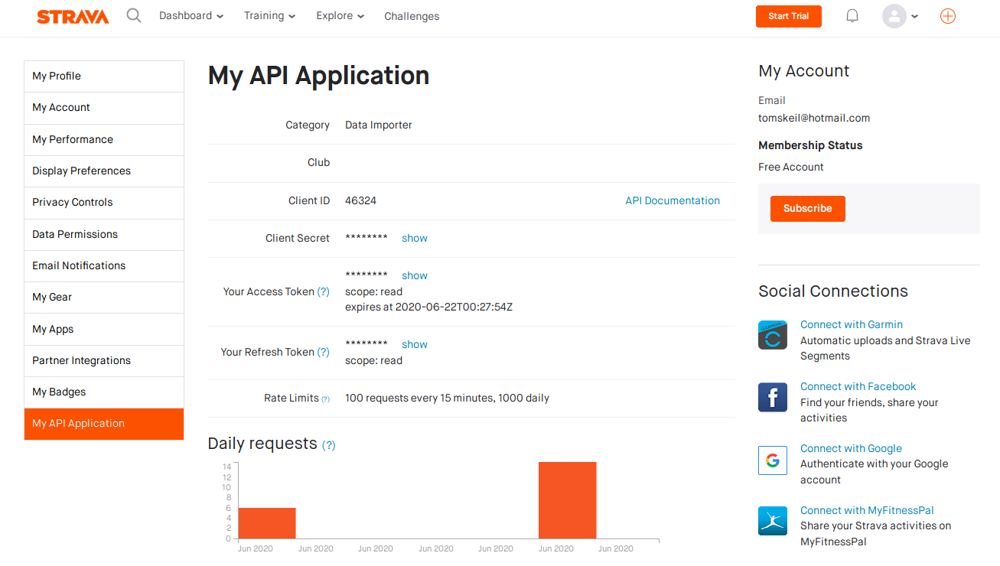

# Strava Application Programming Interface - Python Wrapper

This project is designed for developers to interact with the 
<a href="https://developers.strava.com/" target="_blank">Strava API</a>
over the customised Python wrapper distribution.

It should allow developers to easily retrieve their synchronised data over the Strava servers and fetch them through a data pipeline to their environment and persistence storage if needed. 

The following steps should illustrate the pre-requisites and the necessary tasks to make the application up and running. 

## 1. Strava account setup

To get things going you must first register a Strava account 
(<a href="https://www.strava.com" target="_blank">Strava Website</a>)
and setup an API application with the necessary access rights: 

    

Please follow the documentation page to complete the setup of the Strava API application: 

<a href="https://developers.strava.com/docs/getting-started/" target="_blank">Getting Started Strava API</a>

The following credentials are required to acquire access to the Strava API:

1. Client ID
2. Client Secret
3. Refresh Token
4. Access Token (optional)

Please bear in mind, that the respective tokens must come with the necessary rights to the respective resources (information on athletes, segments, routes, clubs, gear etc.). 

## 2. Configuration file setup

The Strava API Python wrapper uses a local configuration file (.ini) to source the necessary confidential credentials into the package. The following configuration file can be placed in the [project folder](./garmin_mod/) of the source code and should contain the following in the exact naming convention: 

[StravaCredentials]  
client_id: CLIENT_ID  
client_secret: CLIENT_SECRET  
refresh_token: REFRESH_TOKEN  

## 3. Encapsulated environment dependencies

All necessary dependencies needed to run the application are listed in the 'requirements.txt' file and can be installed into a virtual environment (recommended). 

Furthermore, an editable install based on the setup.py file can be easily achieved by executing the following command in the root directory:

> python setup.py install

Alternatively the Makefile in the root directory comprises all the relevant tasks and targets to build, test and run the application. 

> make build

# Quick start guide

To be continued ...
